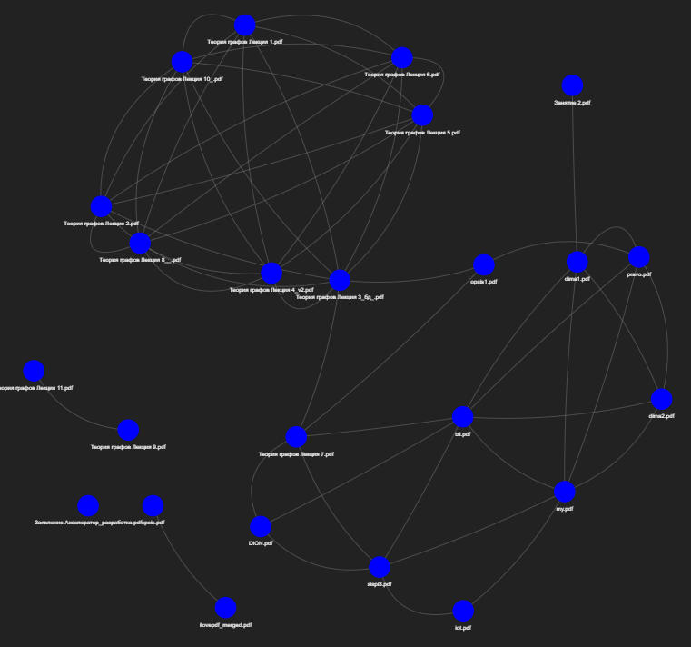
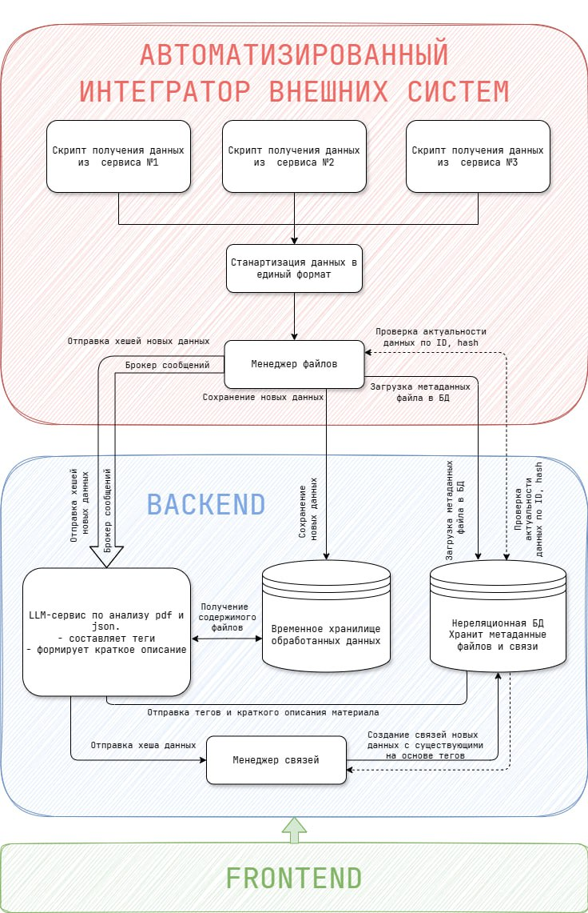

# 📂 Dracula.Graph
*Разработано командой Кукумберы*
### **Описание**
Данный проект - это сервис для объединения разрозненных источников информации, преобразованных в pdf в связанную систему со связями, созданными на основе тегов, сформированных с помощью LLM.

*Пилотная версия.*

---

## **Запуск проекта**
Для развёртывания проекта требуются:
- **Docker**
- **Python 3.11**  
1. **Склонируйте репозиторий**:  
```sh
git clone https://github.com/Petros607/Samara_hackaton_T2
cd Samara_hackaton_T2
```
2. **Создайте файл `.env`** и укажите переменные окружения:  
```sh
MINIO_USER = "minioadmin"
MINIO_PASSWORD="minioadmin"
MINIO_BUCKET="test"
MINIO_ENDPOINT="minio:9000"
```
3. **Установка и запуск Minio**
```sh
docker pull minio/minio
docker run -p 9000:9000 -p 9001:9001 quay.io/minio/minio server /data --console-address ":9001"
```
4. **Установка зависимостей Python**
    4.1. Создние виртуального окружения
    ```sh
    python -m venv venv
    ./venv/Scripts/activate.bat
    ```
    4.2. Установка зависимостей
    ```sh
    pip install -r requirements.txt
    ```
5. **Запуск сервиса**:  
```sh
uvicorn app.app:app --reload --port 8081
```
---

## **Как открыть сервис**
- **MinIO Web UI**: [http://localhost:9001](http://localhost:9001)  
   Логин: `minioadmin` | Пароль: `minioadmin`
   Хранит все загруженные в сервис файлы
- **API (Swagger UI)**: [http://localhost:8081/docs](http://localhost:8081/docs) 
    В силу отсутсвия UI протестировать сервис можно через Swagger, либо через Postman.
- **API**: [http://localhost:8081](http://localhost:8081)
    Postman-коллекция: Dracula-Graph.postman_collection.json
---

## **Результат работы**
Сервис возвращает сгенерированный html-документ.
_Пример созданного графа:_  


---

##  **Планируемые улучшения**
🔹 Поддержка обработки различных сервисов
🔹 Оптимизация генерации тегов  
🔹 Добавление поиска по загруженным документам  
🔹 Интеграция с базой данных для хранения метаданных  
🔹 Создание автоматизированных скриптов сбора данных на Windmill

# Схема будущего сервиса


